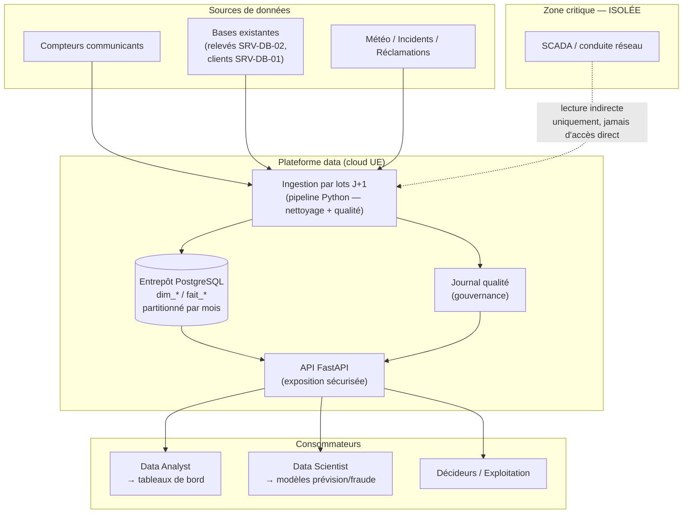

# Architecture technique — Néovolt Grid+ (Volet Data Engineering)

## Vue d'ensemble (architecture cible)

> Le SCADA reste **isolé** : la plateforme ne s'y connecte pas directement.
> Toute donnée issue de la conduite réseau transite par un export contrôlé,
> jamais par un accès direct (contrainte « isolement du SCADA »).

## Choix techniques et justification

| Choix | Justification (ancrée sur les contraintes Néovolt) |
|---|---|
| **PostgreSQL** comme entrepôt | Standard ouvert → **réversibilité** (pas d'enfermement fournisseur). Gère le volume via le partitionnement. |
| **Partitionnement mensuel** de `fait_releve_conso` | **Volumétrie** réelle ~220 M lignes/an (600 000 PDL × relevés quotidiens). Élagage des partitions pour la **rétention 3 ans**. |
| **Ingestion par lots J+1** | Respecte le niveau de service « fraîcheur J+1 » sans la complexité d'un flux temps réel. Le code est orchestrable par Airflow/cron. |
| **API FastAPI** | Découple producteurs et consommateurs : analystes, data scientists et dashboards consomment la **même** donnée propre, fini les Excel personnels (dette technique du SI existant). |
| **Conteneurisation (Docker)** | Prototype **reproductible** (« relançable à partir de la doc ») et **réversible** (portable hors d'un cloud donné). |
| **Hébergement cloud UE** | **Souveraineté** : données de consommation = données personnelles à héberger dans l'Union européenne. |
| **Coexistence, pas remplacement** | Le pipeline *lit* les bases existantes ; il ne les remplace pas (contrainte d'intégration). |

## Scalabilité / haute disponibilité / résilience (cible)

- **Scalabilité** : l'API est sans état (stateless) → réplicable horizontalement derrière un load balancer ; la base monte en charge via partitionnement + réplicas en lecture.
- **Haute disponibilité (99,5 %)** : PostgreSQL en réplication primaire/secondaire, bascule automatique.
- **Résilience** : ingestion **idempotente** (rejouable sans doublon grâce à la clé `(id_pdl, date)`) ; en production, passage possible à une file de messages pour absorber les pics de relevés.

## Ce que le prototype réalise vraiment (vs cible)

Réalisé et testé : ingestion + nettoyage + journal qualité + entrepôt + API.
Esquissé (documenté, non déployé ici) : partitionnement, réplication HA, orchestration Airflow, file de messages temps réel.
